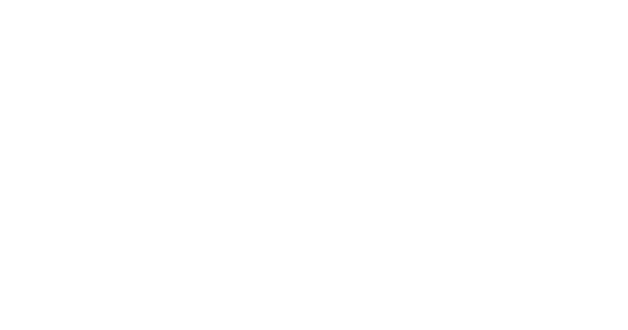
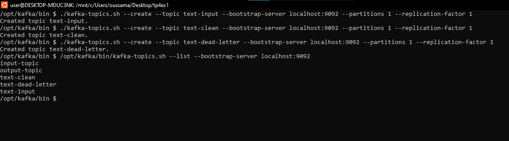
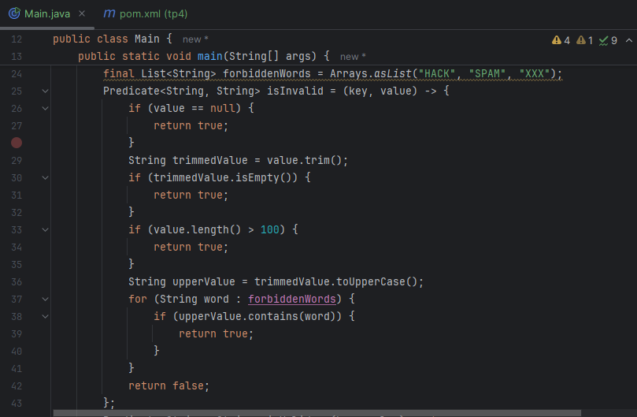
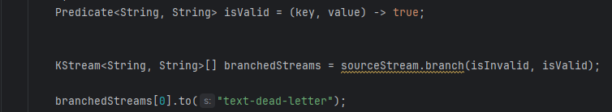
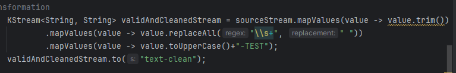
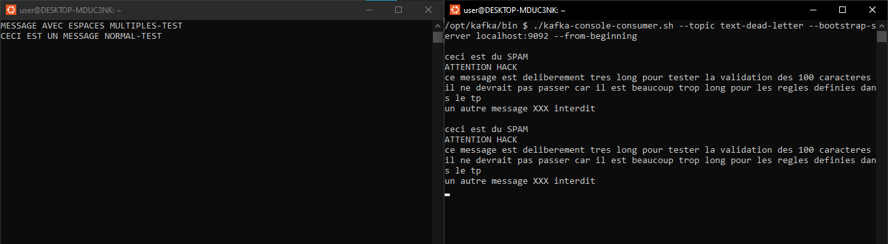

# Kafka Streams – Traitement de Texte avec Dead Letter Queue

  

Ce projet est une application Kafka Streams qui implémente un pipeline de nettoyage et de validation de messages textuels. Il lit les messages d'un topic, les valide par rapport à un ensemble de règles, et route les messages valides et invalides vers des topics de sortie distincts.
---

## 1. Créer les topics suivants 

* `text-input` – input topic
* `text-clean` – valid cleaned messages
* `text-dead-letter` – invalid messages

---

## 2. Filtrer les messages selon les règles suivantes

* Rejeter les messages vides ou constitués uniquement d’espaces
* Rejeter les messages contenant certains mots interdits (ex. : HACK, SPAM,XXX)
* Rejeter les messages dépassant une longueur de 100 caractères
* Les messages invalides sont envoyés tels quels dans le topic text-dead-letter

---

## 3. Effectuer les traitements suivants 

* Supprimer les espaces avant/après (trim)
* Remplacer les espaces multiples par un seul espace
* Convertir la chaîne en majuscules
* Les messages valides (après filtrage + nettoyage) sont envoyés dans le topic text-clean

---

## 4. Test

* Envoyer plusieurs messages (valides / invalides) dans text-input
* Vérifier que les messages apparaissent dans le bon topic (text-clean ou text-dead-letter)

